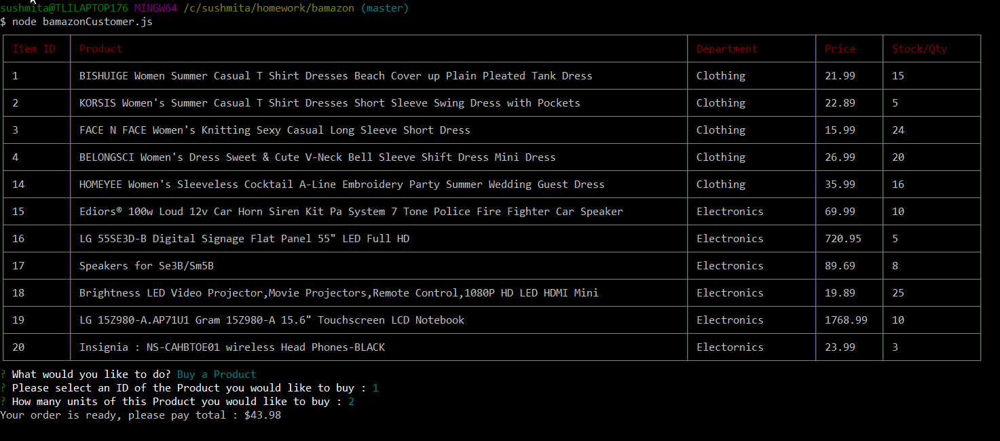

# bamazon

## Overview

### Bamazon is like Amazon!
Two applications are created :

      Challenge #         Name                application Name
      _________________________________________________________
           1            Customer View        bamazonCustomer.js
           2            Manager View         bamazonManager.js

## npm Dependencies
mysql
inquirer
cli-table2

## Database and Table Creation

also added dummy records (seeding) using csv file.
  

## To make CLI project working
* Clone github repo using : git clone https://github.com/FULLSTACK-SY/bamazon.git
* From Bamazon folder run : npm install

## Logic :
### 1. Customer View
##### COMMAND => node bamazonCustomer.js
* Application will first display all of the items available for sale.
* The app then will prompt the actions : 1. Buy a Product   2. Exit
##### OUTPUT =>
  
##### CODE =>
  

* If user selects to 'Buy a Product', the app will then prompt user for : 1. ID of the product they would like to buy   2.units
Once the customer has placed an order, checking if store has enough of the product to meet the customer's request.
    * If YES : showing the customer total cost of their purchase, with 7 seconds pause.
         then showing remaining store stock(updating table for te stock), prompting to 'Buy another product' or 'Exit'
    * If NO : displaying Insufficient quantity! and preventing the order from going through.
##### OUTPUT for YES =>
  
* Sample Dropdown for Product to buy
  
* After updating table-> display of remaining stock with options
  
##### OUTPUT for NO =>
  
##### CODE =>
  

### 2. Manager View
##### COMMAND => node bamazonManager.js
* Listing below options:
    * View Products for Sale
    * View Low Inventory
    * Add to Inventory
    * Add New Product
##### OUTPUT =>
  
##### CODE =>
  

* If manager selects View Products for Sale, the app will display: item IDs, names, prices, and quantities.
##### OUTPUT =>
  
##### CODE =>
  

* If a manager selects View Low Inventory, then listing all items with an inventory count lower than five.
##### OUTPUT =>
  
##### CODE =>
  

* If a manager selects Add to Inventory, then prompting to "add more" of any item currently in the store.
* If manager enters qty<=0 giving error message.
##### OUTPUT =>
  
  
##### CODE =>
  

* If a manager selects Add New Product, allowing the manager to add a completely new product to the store.
##### OUTPUT =>
  
##### CODE =>
  

### Added to my Portfolio
  

------------------------------------------------------------------------------------------------------------------------------------------------
